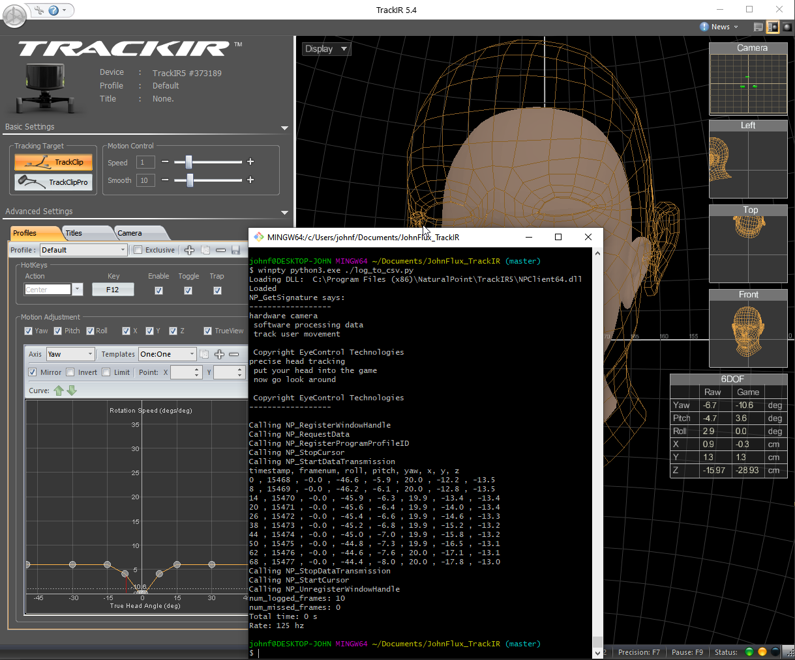

This is a windows-only program and library to read the 6 DOF (six degrees of freedom: x,y,z,roll,pitch,yaw) data from a TrackIR camera.



To use, buy a TrackIR device, and run the TrackIR software, and make sure that it's working there.  If you want raw data, make sure you set the profile to "one:one" and set the smoothing to 0.

Then run the `log_to_csv.py`  program, and see the data printed out at approximately 100hz.

Running python 3 in Windows
===========================

To run, you can use run it within visual studio code, or from a git bash command line like:

    winpty python3.exe ./log_to_csv.py

(It might ask you to install python3 first)

Or log to a file like:

    winpty python3.exe ./log_to_csv.py > log.csv

Using the library
=================

To use the library it is as simple as:

```python
    import tkinter
    import time
    from trackir import TrackIRDLL

    trackrIr = TrackIRDLL(tkinter.Tk().wm_frame())
    while True:
        data = trackrIr.NP_GetData()
        print(data)
        time.sleep(0.1)
```

Please see [log_to_csv.py](log_to_csv.py) for more details.